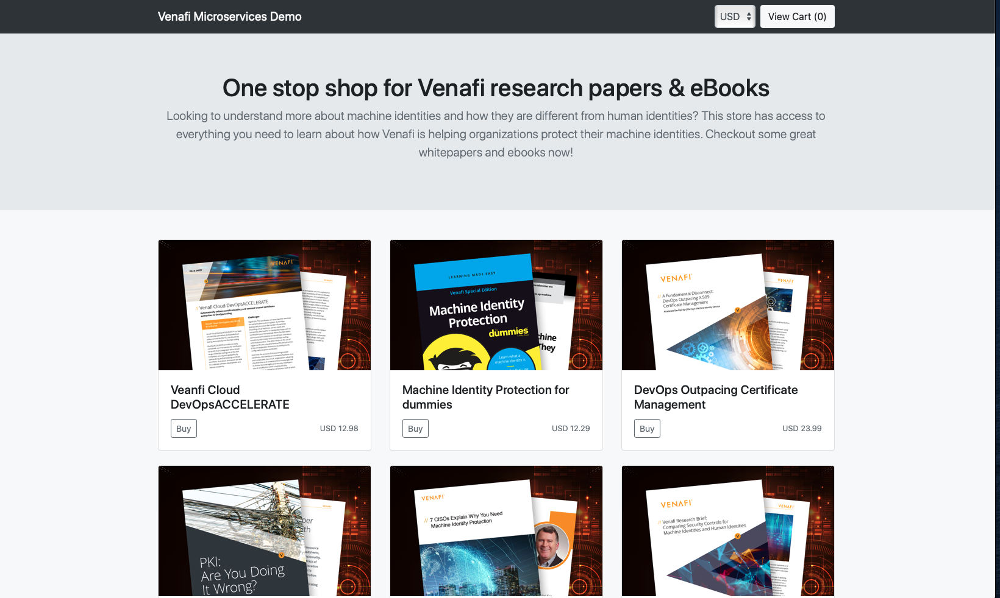
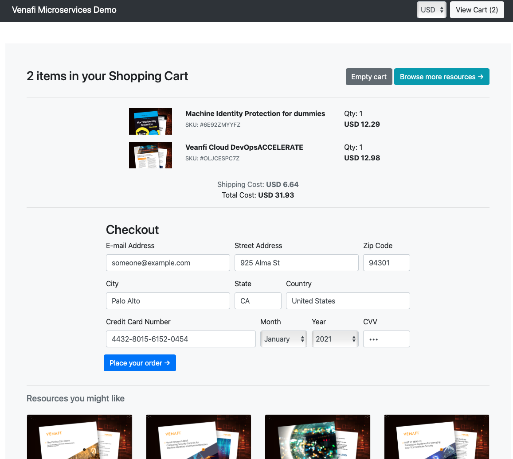

**Originally developed by Google to demonstrate use of technologies like Kubernetes/GKE, Istio, Stackdriver, gRPC and OpenCensus to showcase a microservices demo**.

**The customization involves securing this application with certificates issued by Venafi. The instructions are extended to install cert-manager and configuring Venafi as a certificate issuer to protect machine identities. Machines identities here translates to ingresses, service mesh where encryption is needed.**

# Book Store: Securing Cloud-Native Microservices with Venafi - Demo

This project contains a 10-tier microservices application. The application is a
web-based e-commerce app called **“Book Store”** where users can browse whitepapers, eBooks
add them to the cart, and purchase them. The project explores machine identities as it applies to the application and demonstrates ways to protect them to make sure data is encrypted everywhere.  

This application works on any Kubernetes cluster (including a local one. It’s **easy to deploy with little to no configuration**.

## Screenshots

| Home Page                                                                                                         | Checkout Screen                                                                                                    |
| ----------------------------------------------------------------------------------------------------------------- | ------------------------------------------------------------------------------------------------------------------ |
| [](./docs/img/book-store-frontend-1.png) | [](./docs/img/book-store-frontend-2.png) |

## Service Architecture

**Book Store** (originally Hipster Shop) is composed of many microservices written in different
languages that talk to each other over gRPC.

[](./docs/img/architecture-diagram.png)


| Service                                              | Language      | Description                                                                                                                       |
| ---------------------------------------------------- | ------------- | --------------------------------------------------------------------------------------------------------------------------------- |
| [frontend](./src/frontend)                           | Go            | Exposes an HTTP server to serve the website. Does not require signup/login and generates session IDs for all users automatically. |
| [cartservice](./src/cartservice)                     | C#            | Stores the items in the user's shopping cart in Redis and retrieves it.                                                           |
| [productcatalogservice](./src/productcatalogservice) | Go            | Provides the list of products from a JSON file and ability to search products and get individual products.                        |
| [currencyservice](./src/currencyservice)             | Node.js       | Converts one money amount to another currency. Uses real values fetched from European Central Bank. It's the highest QPS service. |
| [paymentservice](./src/paymentservice)               | Node.js       | Charges the given credit card info (mock) with the given amount and returns a transaction ID.                                     |
| [shippingservice](./src/shippingservice)             | Go            | Gives shipping cost estimates based on the shopping cart. Ships items to the given address (mock)                                 |
| [emailservice](./src/emailservice)                   | Python        | Sends users an order confirmation email (mock).                                                                                   |
| [checkoutservice](./src/checkoutservice)             | Go            | Retrieves user cart, prepares order and orchestrates the payment, shipping and the email notification.                            |
| [recommendationservice](./src/recommendationservice) | Python        | Recommends other products based on what's given in the cart.                                                                      |
| [adservice](./src/adservice)                         | Java          | Provides text ads based on given context words.                                                                                   |
| [loadgenerator](./src/loadgenerator)                 | Python/Locust | Continuously sends requests imitating realistic user shopping flows to the frontend.                                              |

## Installing the Application

To install the bookstore app run the following steps
1. **Minikube** (~20 minutes) You will deploy the microservices image to a single-node
   Kubernetes cluster running on your development machine.
   - Create a new minikube by running `minikube start --cpus=4 --memory 4096` You can use your existing minikube as well.
   - Setup bookstore by running `kubectl apply -f https://raw.githubusercontent.com/sitaramkm/microservices-demo/master/release/kubernetes-manifests.yaml`
   - Get your minikube ip by running `minikube ip`
   - Find the NodePort of the frontend-external svc and access the BookStore as `http://<minikubeip>:<frontend-external-svc-nodeport>`

2. **Kind** (~20 minutes) You will deploy the microservices image into a single-node
   Kubernetes cluster running on Docker in your development machine.
   - Download Docker for Desktop and make sure Kubernetes is enabled
   - Setup bookstore by running `kubectl apply -f https://raw.githubusercontent.com/sitaramkm/microservices-demo/master/release/kubernetes-manifests.yaml`
   - Access the BookStore on your Docker for Desktop using `http://localhost`

3. **Cloud** (~15 minutes) Deploy the microservices into your cloud managed Kubernetes
   cluster.
   - Setup bookstore by running `kubectl apply -f https://raw.githubusercontent.com/sitaramkm/microservices-demo/master/release/kubernetes-manifests.yaml`
   - Find the external ip (this will be the loadbalancer) for frontend-external service.  
   - Access the BookStore as `http://<external-load-balancer-url>`

### Validating the deployed application
Depending on what you chose to deploy the application you should able to test it with the NodePort (in case of minikube) or using the external IP (localhost in case of Docker and the loadBalancer if deployed on the cloud) You can always find the external-ip of the front end service by running one of the following. In Google Cloud Platform you will get the external-ip using `ip`  and in AWS you will get the external-ip using `hostname`
```
kubectl get svc frontend-external -o jsonpath="{.status.loadBalancer.ingress[*].hostname}"
kubectl get svc frontend-external -o jsonpath="{.status.loadBalancer.ingress[*].ip}"
```

The deployed application is functional and works great. However, we want to work on securing the application with a publicly trusted certificate and also ensure that all service to service communication is encrypted.

## Install & Configure [NGNIX Ingress Controller](https://kubernetes.github.io/ingress-nginx/deploy/)  
This instructions does not apply to minikube. On minikube simply run `minikube addons enable ingress` to enable ingress.
 To install nginx ingress controller, simply run the following. For more details / additional configurations / installing using Helm, etc go to the [documentation page](https://kubernetes.github.io/ingress-nginx/deploy/)

```
kubectl apply -f https://raw.githubusercontent.com/kubernetes/ingress-nginx/nginx-0.30.0/deploy/static/mandatory.yaml
kubectl apply -f https://raw.githubusercontent.com/kubernetes/ingress-nginx/nginx-0.30.0/deploy/static/provider/cloud-generic.yaml
```

**NOTE** that the instruction here installs version **0.30.0** of nginx-controller. To find the most recent release visit the nginx-ingress GitHub repository.

### Validating NGINX ingress controller
To check the version you have deployed run
```
POD_NAMESPACE=ingress-nginx
POD_NAME=$(kubectl get pods -n $POD_NAMESPACE -l app.kubernetes.io/name=ingress-nginx -o jsonpath='{.items[0].metadata.name}')
kubectl exec -it $POD_NAME -n $POD_NAMESPACE -- /nginx-ingress-controller --version

```
## Install cert-manager [cert-manager ](https://cert-manager.io/docs/)

The manifest file that you use will depend on the server Kubernetes version. If > 1.15 then use `cert-manager.yaml` else use `cert-manager-legacy.yaml`

Install cert-manager by simply running
```
If kubernetes server version > 1.15
  kubectl apply --validate=false -f https://github.com/jetstack/cert-manager/releases/download/v0.14.2/cert-manager.yaml
else
  kubectl apply --validate=false -f https://github.com/jetstack/cert-manager/releases/download/v0.14.2/cert-manager-legacy.yaml
```

To install cert-manager using Helm charts visit the documentation page.
**Note** that the instruction here installs version **v0.14.2** of cert-manager. To find the most recent release version visit the cert-manager GitHub repository

### Validating the cert-manager installation
The install creates 3 deployments(replicaSet = 1) and 2 services. Simply run `kubectl get all -n cert-manager` to validate everything is good. If you have deployed using Helm, there is a better way to validate your install and also check the version of cert-manager.

## Install Istio  


## Automated Machine Identity Protection with [Venafi](venafi.com)

**Assumptions**
1. You have access to Venafi cloud. If you don't have one, sign up for an [account ](https://ui.venafi.cloud/login)
2. You are able to login and access a Project. In the project details page verify that you see a list of integrations .
3. Click on Kubernetes to open the sample configuration. Make a note of the apikey and zone. The apikey and zone look similar but apikey is used for creating a secret and zone is used to configure the certificate issuer.

## Configuring your cluster to use Venafi as certificate issuer
Venafi will issue certificates using cert-manager, a native Kubernetes certificate management controller. The apikey and zone UUID is needed to configure cert-manager to use Venafi as the issuer.

1. Configure cert-manager to use Venafi Cloud. This will require creating two resources.

   a. Create a secret
   ```
   VENAFI_CLOUD_API_KEY=REPLACE_WITH_API_KEY
   kubectl create secret generic venafi-prd-cloud-secret --namespace=cert-manager --from-literal=apikey=$VENAFI_CLOUD_API_KEY
   ```

   b. Create a ClusterIssuer. ClusterIssuer is a custom resource from cert-manager. Look at the docs to understand more about Issuers and ClusterIssuers.  E.g.:
   ```
   apiVersion: cert-manager.io/v1alpha2
   kind: ClusterIssuer
   metadata:
     name: venafi-prd-cloud-issuer
     namespace: cert-manager
   spec:
     venafi:
       zone: "REPLACE_WITH_ZONE_ID"
       cloud:
         apiTokenSecretRef:
          name: venafi-prd-cloud-secret # secret that holds the apikey to Venafi cloud
          key: apikey
    
    $ kubectl create -f venafi-cloud-issuer.yaml
     ```
   Both these resources are created in the cert-manager space. Validate that the issuer is correctly configured by running
   `kubectl describe ClusterIssuer venafi-prd-cloud-issuer`

   ```
   Events:
     Type    Reason  Age   From          Message
     ----    ------  ----  ----          -------
     Normal  Ready   23s   cert-manager  Verified issuer with Venafi server
   ```

   The message `Verified issuer with Venafi server` indicates that you are ready to issue certificates using Venafi.

## Securing the front end
The following instructions apply when the bookstore application has been deployed on a Cloud managed Kubernetes cluster.

### Certificate resources
In this example we will create a certificate resource in the namespace where the bookstore application is deployed. This certificate will
be referenced in the next step where we bind it to an Ingress rule.

NOTE: The examples below will use the FQDN `mobileapptest.example.com`. Replace this FQDN with a valid one for your environment.

```
apiVersion: cert-manager.io/v1alpha2
kind: Certificate
metadata:
        name: cloud-venafi-demo
        namespace: default
spec:
        secretName: cert-venafi-demo
        issuerRef:
                name: venafi-prd-cloud-issuer
                kind: ClusterIssuer
        commonName: mobileapptest.example.com
```

Save the YAML to a file named `certificate.yaml`.

Create the certificate by using `kubectl apply -f certificate.yaml`. Verify the certificate has been created using
`kubectl describe -f certificate.yaml`. The following output indicates the certificate has been issued successfully.

```
API Version:  cert-manager.io/v1alpha2
Kind:         Certificate
Metadata:
  Creation Timestamp:  2020-04-26T17:35:21Z
  Generation:          1
  Resource Version:    14363235
  Self Link:           /apis/cert-manager.io/v1alpha2/namespaces/default/certificates/cloud-venafi-demo
  UID:                 4dcc8546-87e4-11ea-b3a7-720340d5019b
Spec:
  Common Name:  mobileapptest.example.com
  Issuer Ref:
    Kind:       ClusterIssuer
    Name:       venafi-prd-cloud-issuer
  Secret Name:  cert-venafi-demo
Status:
  Conditions:
    Last Transition Time:  2020-04-26T17:35:24Z
    Message:               Certificate is up to date and has not expired
    Reason:                Ready
    Status:                True
    Type:                  Ready
  Not After:               2020-07-25T17:35:22Z
Events:
  Type    Reason        Age   From          Message
  ----    ------        ----  ----          -------
  Normal  GeneratedKey  30m   cert-manager  Generated a new private key
  Normal  Requested     30m   cert-manager  Created new CertificateRequest resource "cloud-venafi-demo-2486277031"
  Normal  Issued        30m   cert-manager  Certificate issued successfully
```

### Ingress rules
A new ingress rule will be created that will enable TLS on the ingress and reference the secret that was created for the
certificate created above. The Ingress rule will forward traffic to the front-end service (NOT the front-end external service).

```
apiVersion: extensions/v1beta1
kind: Ingress
metadata:
  name: frontend-ingress
  namespace: default
  annotations:
    kubernetes.io/ingress.class: "nginx"
spec:
  tls:
  - hosts:
    - mobileapptest.example.com
    secretName: cert-venafi-demo
  rules:
  - host: mobileapptest.example.com
    http:
      paths:
      - path: /
        backend:
          serviceName: frontend
          servicePort: 80
```

Save the YAML to a file `ingress.yaml`. Use the following command to create the ingress: `kubectl apply -f ingress.yaml`.

Once the ingress has been created, use `kubectl desribe -f ingress.yaml` and verify that the ingress was created and the
annotions to enable TLS and reference the certificate have been created:

```
Name:             frontend-ingress
Namespace:        default
Address:          40.71.234.236
Default backend:  default-http-backend:80 (<none>)
TLS:
  cert-venafi-demo terminates mobileapptest.thehotelcook.com
Rules:
  Host                            Path  Backends
  ----                            ----  --------
  mobileapptest.thehotelcook.com
                                  /   frontend:80 (<none>)
Annotations:
  kubectl.kubernetes.io/last-applied-configuration:  {"apiVersion":"extensions/v1beta1","kind":"Ingress","metadata":{"annotations":{"kubernetes.io/ingress.class":"nginx"},"name":"frontend-ingress","namespace":"default"},"spec":{"rules":[{"host":"mobileapptest.example.com","http":{"paths":[{"backend":{"serviceName":"frontend","servicePort":80},"path":"/"}]}}],"tls":[{"hosts":["mobileapptest.example.com"],"secretName":"cert-venafi-demo"}]}}

  kubernetes.io/ingress.class:  nginx
Events:
  Type    Reason  Age   From                      Message
  ----    ------  ----  ----                      -------
  Normal  CREATE  22m   nginx-ingress-controller  Ingress default/frontend-ingress
  Normal  UPDATE  21m   nginx-ingress-controller  Ingress default/frontend-ingress
```

You should now be able to open up your browser to https://mobileapptest.example.com and view the bookstore application.

## Securing the service mesh

###  Optional (ignore for now). This scenario is specific to AWS and we are also trying to show some Terraform examples to manage certificates.
In the first example (simple scenario) we will
1. Create DNS entry to map a domain name to the external-ip.
   If you have access to Route53 on AWS and can create record sets, use the sample terraform scripts available [here](tools/terraform/route53)  
   Once you have a CNAME record defined as an alias for the A record you should be able to access the book store from the browser using the alias. For e.g, mystore.example.com
2. Request a certificate using Venafi
   Terraform examples to request a certificate from Venafi Cloud is [here](tools/terraform/venafi-cert)
3. There are several ways to bind the certificate (use Terraform or any other tool). Here, we will simply use AWS CLI
`aws elb create-load-balancer-listeners --load-balancer-name <NAME_OF_ELB> --listeners Protocol=HTTPS,LoadBalancerPort=443,InstanceProtocol=HTTP,InstancePort=80,SSLCertificateId=arn:aws:acm:<cert-arn>`
4. Try mystore.example.com or https://mystore.example.com from the browser to access the store frontend.

### Cleanup

If you've deployed the application with `kubectl apply -f [...]`, you can
run `kubectl delete -f [...]` with the same argument to clean up the deployed
resources.

Additional Resources
- Here's the feature list **[Features ](https://github.com/GoogleCloudPlatform/microservices-demo#features):**
- Build and install from scratch **[Instructions ](https://github.com/GoogleCloudPlatform/microservices-demo#installation):**

---

This readme is derived from Google's microservices demo and is not an official project. The objective of this project is hands-on learning.
